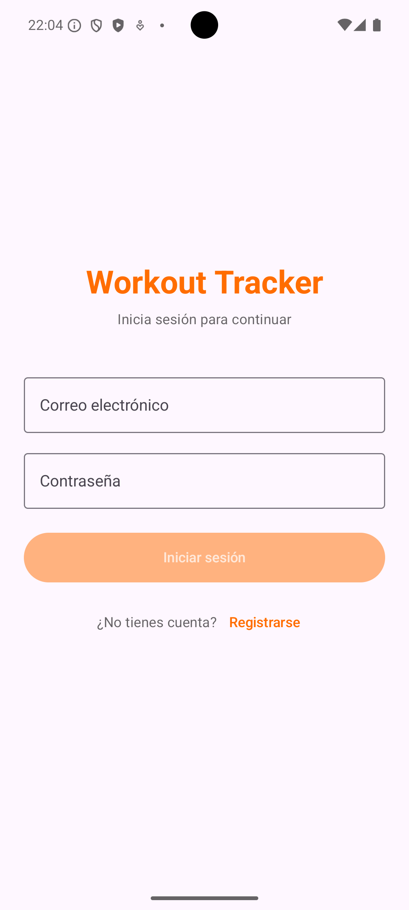
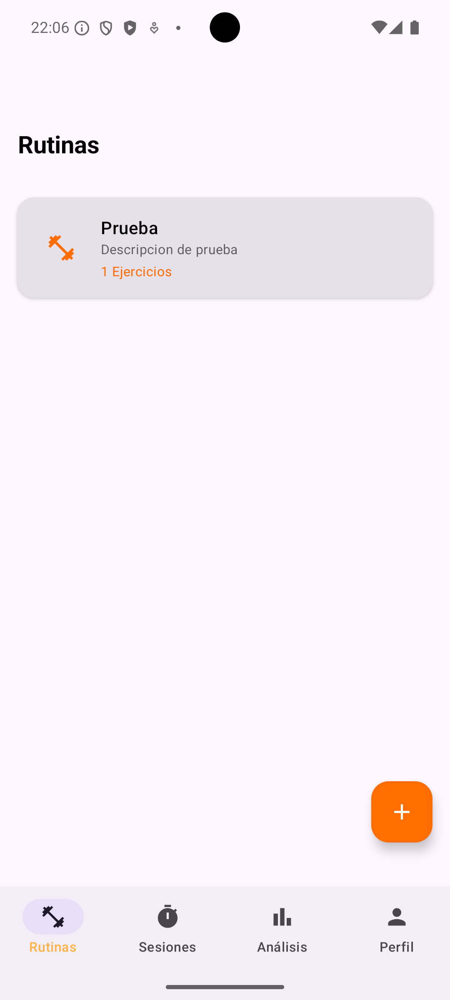
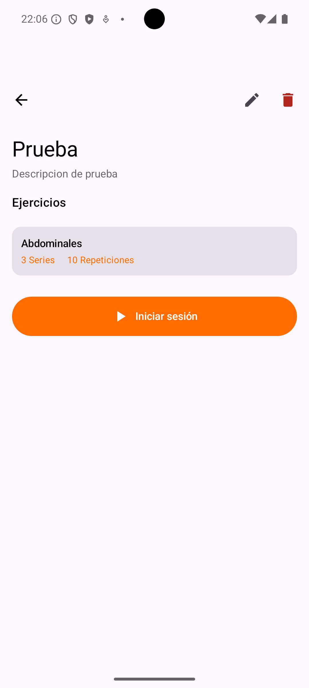
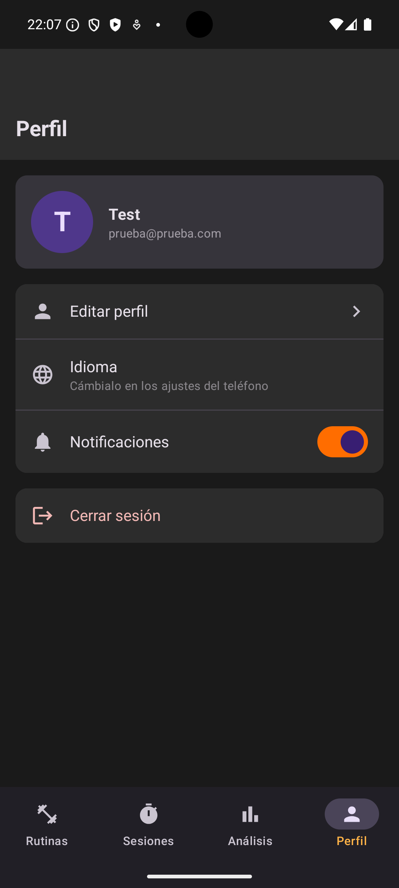
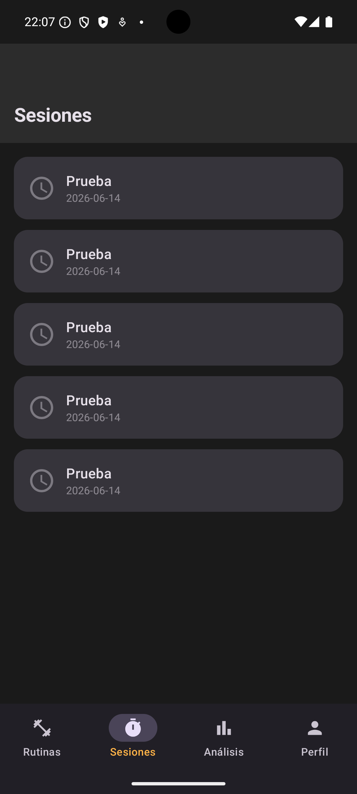
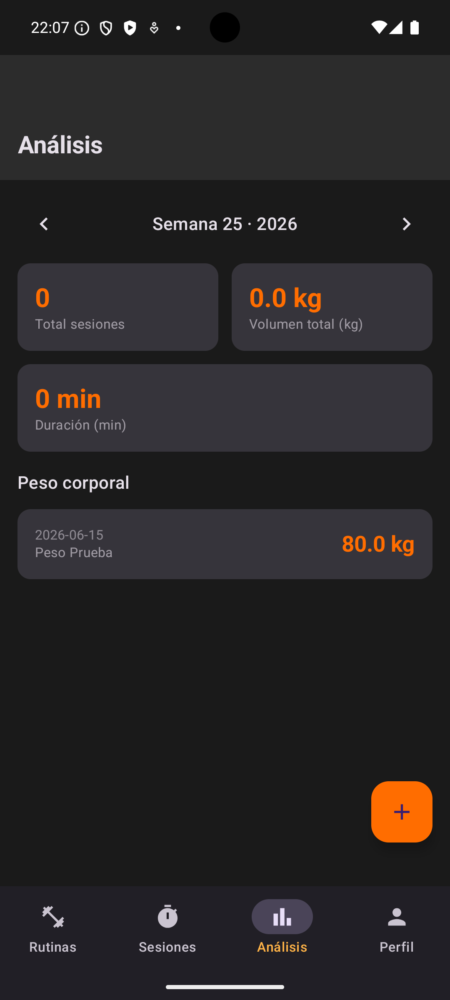

# Workout Tracker

An Android workout tracking app built as part of the [CastroDev](https://castrodev.com) portfolio. Create and manage your workout routines, track your training sessions with exercise sets and reps, monitor your weekly analytics and body weight evolution.

---

## 📱 Screenshots

<p align="center">
  
  
  
  
</p>
<p align="center">
  
  
</p>

---

## ✨ Features

- 💪 **Routines** — Create and manage workout routines with custom exercises, sets, reps, weight and rest time
- ✏️ **Edit routines** — Update name, description and exercises at any time
- ▶️ **Sessions** — Start training sessions from a routine and complete them marking sets as done
- 📋 **Session history** — View all past completed sessions
- 📊 **Weekly analytics** — Total sessions, volume and duration per week with navigation between weeks
- ⚖️ **Body weight tracking** — Log your daily weight and track your evolution over time
- 🌙 **Dark mode** — Automatic dark/light mode based on system settings
- 👤 **Profile** — Edit name, manage notifications; language follows system settings
- 🌍 **Multilingual** — English and Spanish support

---

## 🛠️ Tech Stack

| Layer | Technology |
|---|---|
| Language | Kotlin |
| UI Framework | Jetpack Compose |
| State Management | ViewModel + StateFlow |
| Authentication | Firebase Auth (Email) |
| Backend | .NET 10 REST API (Clean Architecture) |
| Database | Cloud Firestore |
| Networking | Retrofit + OkHttp |
| Infrastructure | Google Cloud Run |

---

## 🏗️ Architecture

The app follows **Clean Architecture** principles with strict layer separation:

```
workouttracker/
├── core/
│   ├── network/       # API client, token provider, interceptor
│   └── theme/         # Colors, typography, Material3 theme
├── features/
│   ├── auth/          # Login, register
│   ├── routines/      # Routine CRUD with exercises
│   ├── sessions/      # Session tracking with set completion
│   ├── analytics/     # Weekly summary and body weight
│   ├── bodyweight/    # Body weight logging
│   └── profile/       # User profile & settings
└── navigation/        # App navigation & bottom tabs
```

Each feature follows the pattern:

```
Feature/
├── data/
│   ├── datasource/    # Retrofit API service & remote data source
│   ├── model/         # DTO models & request/response
│   └── repository/    # Repository implementations
├── domain/
│   ├── entity/        # Domain entities
│   ├── repository/    # Abstract repository interfaces
│   └── usecase/       # Business logic use cases
└── presentation/
    ├── screen/        # Composable screens
    ├── viewmodel/     # ViewModels with StateFlow
    └── components/    # Reusable UI components
```

---

## 🚀 Getting Started

### Prerequisites

- Android Studio Hedgehog or later
- Android SDK 26+
- Firebase project configured
- API running at `api.castrodev.com` or locally

### Installation

```bash
# Clone the repository
git clone https://github.com/castrodev/workout-tracker-android.git

# Open in Android Studio
```

Then:

1. Add your `google-services.json` to the `app/` folder
2. Sync Gradle dependencies
3. Build and run with the Run button or `Shift + F10`

### Running Tests

```bash
./gradlew test
./gradlew connectedAndroidTest
```

---

## 🔗 Related

- [CastroDev API](https://github.com/castrodev/castrodev-api) — Shared .NET 10 backend
- [Finance Tracker](https://github.com/castrodev/finance-tracker) — Personal finance app (Flutter)
- [Habit Tracker](https://github.com/castrodev/habit-tracker) — Daily habit tracking app (Flutter)
- [Task Manager](https://github.com/castrodev/task-manager-ios) — Board-based task management (iOS)
- [Budget Scanner](https://github.com/castrodev/budget-scanner-ios) — Budget & expense tracking (iOS)
- [Recipe Manager](https://github.com/castrodev/recipe-manager-android) — Recipe & meal planning app (Android)
- [castrodev.com](https://castrodev.com) — Portfolio

---

## 📄 License

MIT © [Gabriel Castro](https://castrodev.com)

---

---

# Workout Tracker

App Android de seguimiento de entrenamientos desarrollada como parte del portfolio de [CastroDev](https://castrodev.com). Crea y gestiona tus rutinas de entrenamiento, registra tus sesiones con los ejercicios completados, y monitoriza tu progreso semanal y tu evolución de peso corporal.

---

## ✨ Funcionalidades

- 💪 **Rutinas** — Crea y gestiona rutinas con ejercicios personalizados, series, repeticiones, peso y tiempo de descanso
- ✏️ **Editar rutinas** — Actualiza nombre, descripción y ejercicios en cualquier momento
- ▶️ **Sesiones** — Inicia sesiones de entrenamiento desde una rutina y complétalas marcando las series
- 📋 **Historial de sesiones** — Consulta todas las sesiones completadas
- 📊 **Análisis semanal** — Total de sesiones, volumen y duración por semana con navegación entre semanas
- ⚖️ **Peso corporal** — Registra tu peso diario y sigue tu evolución en el tiempo
- 🌙 **Modo oscuro** — Modo oscuro/claro automático según la configuración del sistema
- 👤 **Perfil** — Edita tu nombre y gestiona notificaciones; el idioma sigue los ajustes del sistema
- 🌍 **Multiidioma** — Soporte para español e inglés

---

## 🛠️ Stack Tecnológico

| Capa | Tecnología |
|---|---|
| Lenguaje | Kotlin |
| UI Framework | Jetpack Compose |
| Estado | ViewModel + StateFlow |
| Autenticación | Firebase Auth (Email) |
| Backend | API REST .NET 10 (Clean Architecture) |
| Base de datos | Cloud Firestore |
| Red | Retrofit + OkHttp |
| Infraestructura | Google Cloud Run |

---

## 🚀 Instalación

### Requisitos previos

- Android Studio Hedgehog o posterior
- Android SDK 26+
- Proyecto Firebase configurado
- API disponible en `api.castrodev.com` o en local

### Pasos

```bash
# Clonar el repositorio
git clone https://github.com/castrodev/workout-tracker-android.git

# Abrir en Android Studio
```

A continuación:

1. Añade tu `google-services.json` a la carpeta `app/`
2. Sincroniza las dependencias de Gradle
3. Compila y ejecuta con el botón Run o `Shift + F10`

### Tests

```bash
./gradlew test
./gradlew connectedAndroidTest
```

---

## 🔗 Relacionado

- [CastroDev API](https://github.com/castrodev/castrodev-api) — Backend compartido en .NET 10
- [Finance Tracker](https://github.com/castrodev/finance-tracker) — App de finanzas personales (Flutter)
- [Habit Tracker](https://github.com/castrodev/habit-tracker) — App de seguimiento de hábitos (Flutter)
- [Task Manager](https://github.com/castrodev/task-manager-ios) — Gestión de tareas por tableros (iOS)
- [Budget Scanner](https://github.com/castrodev/budget-scanner-ios) — Seguimiento de presupuestos (iOS)
- [Recipe Manager](https://github.com/castrodev/recipe-manager-android) — App de recetas y planificación (Android)
- [castrodev.com](https://castrodev.com) — Portfolio

---

## 📄 Licencia

MIT © [Gabriel Castro](https://castrodev.com)